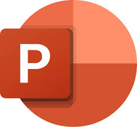

&nbsp;&nbsp;&nbsp;&nbsp;&nbsp;&nbsp;&nbsp;&nbsp;&nbsp;&nbsp;

<h1>PACT: Prompt Auto-Correction and Testing</h1>
<h6>"A golden gateway to improve prompt-engineering skills of the users."</h6>

&nbsp;&nbsp;&nbsp;&nbsp;&nbsp;&nbsp;&nbsp;&nbsp;&nbsp;&nbsp;

&nbsp;&nbsp;&nbsp;&nbsp;&nbsp;&nbsp;&nbsp;&nbsp;&nbsp;&nbsp;

&nbsp;&nbsp;&nbsp;&nbsp;&nbsp;&nbsp;&nbsp;&nbsp;&nbsp;&nbsp;

## Overview  
PACT (Prompt Auto-Correction and Testing) is an advanced system that auto-corrects, sanitizes user inputs, and tests and compares statistics before sending them to the AI. A golden gateway to improve prompt-engineering skills of the users.

## Links  
- **Hosted Website:** [Visit Here](https://pact.azurewebsites.net/)  
- **Demo Video:** [Watch Video](https://youtu.be/hFMdVhcyoR4?feature=shared)  
- **GitHub Repository:** [View on GitHub](https://github.com/grittypuffy/PACT)
- **Presentation Slides:** [Download PDF](/assets/PACT.pdf)

## Table of Contents
- [Introduction](#introduction)
- [Challenge Statement](#challenge-statement)
- [Problems Addressed](#problems-addressed)
- [Features](#features)
- [Azure Technologies Used](#azure-technologies-used)
- [Tech Stack](#tech-stack)
- [Architecture](#architecture)
- [Working](#working)
  - [Input Processing](#1-input-processing)
  - [Sanitization & Optimization](#2-sanitization--optimization)
  - [Testing & Comparison](#3-testing--comparison)
  - [Evaluation](#4-evaluation)
  - [Deployment & Feedback](#5-deployment--feedback)
  - [Infrastructure & Deployment](#6-infrastructure--deployment)
- [Contributors](#contributors)
- [Contributing](#contributing)
- [Project Setup](#project-setup)
- [License](#license)

## Introduction  
PACT (Prompt Auto-Correction and Testing) is an advanced system that refines, sanitizes, and validates user inputs while generating detailed statistics to optimize prompts before they reach the AI. It enhances clarity, removes biases, flags security risks, and ensures compliance with ethical standards. Users can track performance, compare prompts, and refine their prompt-engineering skills through insightful analytics.

## Challenge Statement
Auto Correct and Prompt Validation Before AI Execution
Design a system that auto-corrects and validates user inputs before sending them to the AI
How could a prompt pre-processing layer be implemented that would identify and correct grammatical errors, incomplete queries, or unclear inputs? How do you help users by flagging harmful or sensitive language in their prompts and suggesting safe and ethical alternatives? At same time, can you enhance the clarity and precision of prompts to improve AI output quality? For this project, design a system that auto-corrects and validates user inputs before sending them to the AI, ensuring that prompts are optimized, compliant, and free of potential risks (e.g., bias, harmful language, or sensitive data). Solutions should be effective in identifying and correcting errors or ambiguities in prompts. It’s important to have sensitivity and specificity in detecting harmful or risky language, and that there is an improvement in AI response quality and relevance after prompt correction.

## Problems Addressed  
- **Grammatical and Spelling Errors** in user prompts.  
- **Incomplete or Ambiguous Queries** that lack clarity.  
- **Use of Violent Language** including discriminative and offensive terms.  
- **Jailbreak Attempts** to manipulate AI responses.  
- **No way to Compare Prompt Effectiveness** over time.  
- **Lack of Performance Insights** for users to track improvements.  
- **Challenges in Identifying Bias** in user prompts.  
- **Use of Sensitive Information** that could pose security risks.  
- **Limited Language Support** restricting accessibility.  
- **Lack of Voice Input Support** for ease of use.  

## Features  
- **Optimized Prompt Generation** – Automatically refines prompts for clarity, correctness, and effectiveness.  
- **Grammar and Spell Check** – Detects and corrects grammatical errors, typos, and syntax issues.  
- **Harmful Content Detection** – Flags and sanitizes prompts containing hate speech and violence.  
- **Prompt Auto-Correction & Validation** – Ensures prompts meet quality and compliance standards before processing.  
- **User Prompt vs. Optimized Prompt Comparison** – Displays improvements made to prompts.  
- **User Prompt Statistics Generation** – Provides detailed analytics on prompt performance.  
- **Comparison of User vs. Optimized Prompt Statistics** – Highlights areas of improvement.  
- **AI Response Comparison** – Compares AI responses for user and optimized prompts to measure impact.  
- **Multi-Language Support** – Allows prompts in various languages.  
- **Voice-Based Prompt Input** – Enables speech-to-text for convenience.  
- **Real-Time Feedback** – Provides instant insights on prompt quality.  
- **Bias and Ethical Compliance Checks** – Ensures fairness and neutrality in prompts.  
- **Security & Privacy Validation** – Identifies and removes sensitive or risky data.  
- **Interactive Dashboard** – Visualizes statistics and trends for better understanding.  

## Azure Technologies Used
- **Azure App Service** - A fully managed platform for building, deploying, and scaling web apps.  
- **Azure Container Apps** - A serverless container service to run microservices and APIs.  
- **Azure Container Registry** - A secure registry to store and manage container images.  
- **Azure Cosmos DB for MongoDB** - A globally distributed, NoSQL database with MongoDB compatibility.  
- **Azure OpenAI** - Provides access to OpenAI’s powerful language models for AI-powered applications.  
- **Azure ML Studio** - A cloud-based platform for building, training, and deploying machine learning models.  
- **Azure AI Foundry** - A suite of AI tools and models to enhance AI application development.  
- **Azure Translate** - A language translation service supporting multiple languages.  
- **Azure Cognitive Services** - A collection of AI services for vision, speech, language, and decision-making.  
- **Azure Language API** - Analyzes and processes natural language text for sentiment, key phrases, and more.  
- **Azure Blob Storage** - A scalable object storage solution for unstructured data like text and media files.  
- **Azure Monitor** - A monitoring service that collects, analyzes, and visualizes telemetry data.  
- **Azure Key Vault** - A secure key management service for storing secrets, certificates, and encryption keys.  
- **Azure Security Center** - A unified security management system to detect and respond to threats.  
- **Azure Content Safety** - Identifies and filters harmful or sensitive content to ensure compliance.

## Tech Stack  
- **Frontend:** Next.js, Tailwind CSS  
- **Backend:** Python, FastAPI, LangChain  
- **Containerization:** Docker  
- **Database:** Azure CosmosDB for MongoDB  
- **CI/CD & Version Control:** GitHub, GitHub Actions  
- **Development & Design:** VSCode, Microsoft Designer

## Architecture

## Working  
PACT operates in a structured pipeline to refine user prompts, ensuring clarity, security, and effectiveness. The process involves multiple Azure services and AI-powered optimizations.  

### 1. Input Processing  
- Users enter a prompt via the **Next.js frontend**, either as text or voice input.  
- The UI is hosted on **Azure App Service** and connects to the backend via API calls.  

### 2. Sanitization & Optimization  
- The prompt is sent to the **FastAPI backend**, which utilizes **LangChain** for AI-driven processing.  
- If the input is voice-based, it is processed using **Azure AI Speech** to convert it into text.  
- The text is analyzed by **Azure AI Language** for grammar correction, sentiment analysis, and translation.  
- Sensitive information, including **Personally Identifiable Information (PII)**, is redacted using **Azure AI Foundry** and **Azure Content Safety**.  

### 3. Testing & Comparison  
- The refined prompt is compared with the original user input using **Azure OpenAI** and **Azure AI Evaluation** to measure improvements.  
- **Statistical insights**, including readability, conciseness, and AI response quality, are generated and stored in **Azure CosmosDB for MongoDB** for future analysis.  

### 4. Evaluation  
- The sanitized prompts are further processed using **Azure Machine Learning**, where models such as **Phi-4-mini-instruct** analyze them for effectiveness.  
- Any additional **sensitive information** is removed before the prompts are finalized.  
- The system ensures compliance with **ethical AI standards** using **Azure AI Content Safety**.  

### 5. Deployment & Feedback  
- The final, optimized prompt is sent to **AI models** for response generation.  
- **User history and performance analytics** are logged in **Azure CosmosDB for MongoDB**.  
- **Insights from Log Analytics** help monitor system performance and security.  

### 6. Infrastructure & Deployment  
- The entire application is **containerized using Docker** and deployed via **Azure Container Apps**.  
- The **backend and AI models** run inside an **Azure Container Apps Environment**, ensuring scalability.  
- **Container images** are stored securely in **Azure Container Registry**.  
- **CI/CD** is managed using **GitHub Actions** to streamline updates and deployments.  

This structured pipeline ensures that prompts are accurate, ethical, and AI-friendly while maintaining **security and compliance**.

## Contributors
- **Arun Pranav A T** (LinkedIn: [arunpranavat](https://www.linkedin.com/in/arunpranavat/), GitHub: [arunpranav-at](https://github.com/arunpranav-at))  
- **Aruthra S** (LinkedIn: [aruthra-s-66b97b256](https://www.linkedin.com/in/aruthra-s-66b97b256/), GitHub: [AruthraS](https://github.com/AruthraS))  
- **R S Kierthana** (LinkedIn: [kierthana-rajesh-8b8b42256](https://www.linkedin.com/in/kierthana-rajesh-8b8b42256/), GitHub: [KierthanaRS](https://github.com/KierthanaRS))  
- **Shalini S** (LinkedIn: [sjshalinisrinivasan](https://www.linkedin.com/in/sjshalinisrinivasan/), GitHub: [ShaliniSJ](https://github.com/ShaliniSJ))  
- **Keerthana R** (LinkedIn: [keerthana304](https://www.linkedin.com/in/keerthana304/), GitHub: [grittypuffy](https://github.com/grittypuffy))

## Contributing
We welcome contributions, expecially for improving the AI models and enhancing the prompt optimization process. Feel free to fork the repository, make changes, and submit a pull request. Contributions can involve feedback, reporting of bugs on our platform, documentation, design, code or infrastructure.

## Project Setup
- **Frontend:** [View Repository](https://github.com/grittypuffy/pact-frontend)
- **Backend:** [View Repository](https://github.com/grittypuffy/pact-backend)

## License
PACT is licensed under MIT license, thus allowing permissive usage for your needs. For more information, refer to the [LICENSE](LICENSE) file.